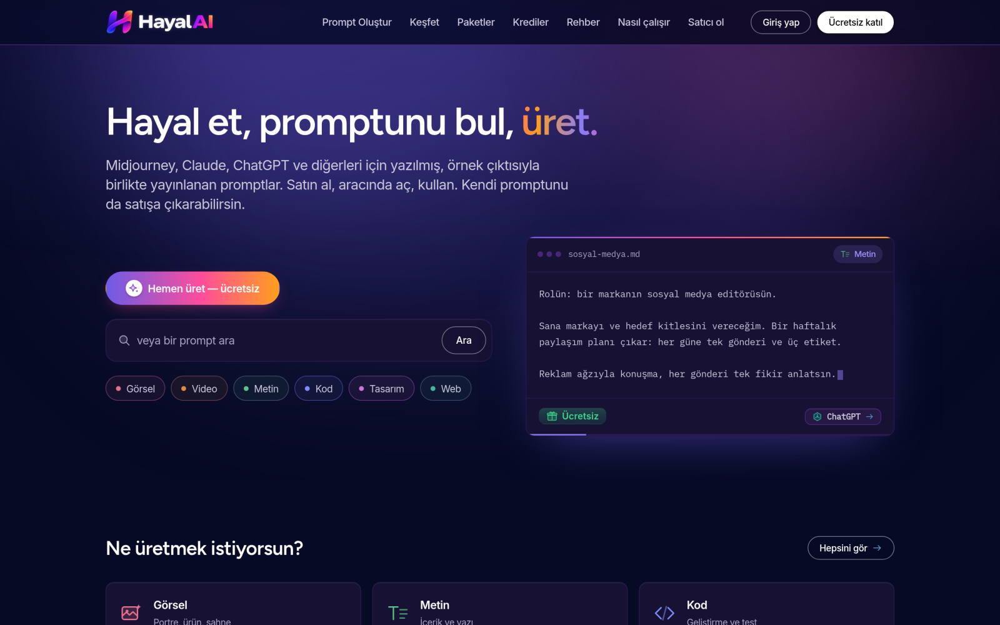

<h1 align="center">
  <a href="https://hayalai.app">
    
    <br>
    HayalAI
  </a>
</h1>

<p align="center">
  <strong>Türkiye'nin en büyük açık prompt kütüphanesi</strong><br>
  <sub>ChatGPT, Gemini, Claude, Midjourney, Sora ve diğerleriyle çalışır</sub>
</p>

<p align="center">
  <a href="https://hayalai.app"></a>
  
  
  <a href="LICENSE"></a>
</p>

<p align="center">
  <a href="#-kategoriler">📚 Promptlara göz at</a> •
  <a href="prompts.csv">📄 Tüm veri (CSV)</a> •
  <a href="https://hayalai.app">✨ Örnek çıktılarıyla gör</a> •
  <a href="SAGLAYICI-NOTLARI.md">🔧 Saha notları</a> •
  <a href="ISTATISTIK.md">📊 Sayılar</a>
</p>

<p align="center">
  <a href="https://hayalai.app">
    
  </a>
</p>

---

## Bu ne?

**17.086 prompt**, her birinin **Türkçe açıklamasıyla** — ne işe yaradığını
anlamak için önce İngilizce metni okumana gerek yok.

| Göz at | Veri olarak al |
|---|---|
| [Kategori kategori](#-kategoriler) | [`prompts.csv`](prompts.csv) — 17.086 satır |
| [hayalai.app](https://hayalai.app) — örnek çıktılarıyla | `title, category, type, tool, description_tr, prompt` |

Promptların ne ürettiğini **görmek** istiyorsan
[hayalai.app](https://hayalai.app): her görsel promptun örneği gerçekten o
promptla üretildi — internetten bulunmuş süs görseli değil.

---

## 📚 Kategoriler

| Kategori | Prompt | Dosyalar |
|---|---:|---|
| 🎨 **Görsel** | 14,947 | [1](promptlar/gorsel-01.md) · [2](promptlar/gorsel-02.md) · [3](promptlar/gorsel-03.md) · [4](promptlar/gorsel-04.md) · [5](promptlar/gorsel-05.md) · [6](promptlar/gorsel-06.md) · [7](promptlar/gorsel-07.md) · [8](promptlar/gorsel-08.md) … [38] |
| ✍️ **Metin** | 1,813 | [1](promptlar/metin-01.md) · [2](promptlar/metin-02.md) · [3](promptlar/metin-03.md) · [4](promptlar/metin-04.md) · [5](promptlar/metin-05.md) |
| 💻 **Kod** | 159 | [aç](promptlar/kod.md) |
| 🌐 **Web** | 57 | [aç](promptlar/web.md) |
| 🎬 **Video** | 33 | [aç](promptlar/video.md) |
| 📣 **Pazarlama** | 31 | [aç](promptlar/pazarlama.md) |
| 🎵 **Ses** | 21 | [aç](promptlar/ses.md) |
| 🖌️ **Tasarım** | 15 | [aç](promptlar/tasarim.md) |
| 📱 **Mobil** | 10 | [aç](promptlar/mobil.md) |

> Görsel kategorisi 38 dosyaya bölündü: GitHub 1 MB üstündeki markdown'ı
> kırpıyor, tek dosya olsa yarısı görünmezdi.

---

## Nasıl kullanılır

**1. Kopyala-yapıştır.** Kategori dosyasını aç, beğendiğin promptu kod
bloğundan kopyala, aracına yapıştır.

**2. Veri olarak.** `prompts.csv` tek dosyada her şey:

```python
import pandas as pd
df = pd.read_csv("prompts.csv")

df[df.category == "gorsel"].sample(5)          # rastgele beş görsel promptu
df[df.prompt.str.contains("cinematic", case=False)]   # kelimeye göre
```

**3. Çalıştırarak.** [hayalai.app](https://hayalai.app) üzerinde promptu
siteden çıkmadan çalıştırıp çıktısını görebilirsin.

---

## Alanlar

| Alan | Açıklama |
|---|---|
| `title` | Promptun adı |
| `category` | gorsel · metin · kod · web · video · pazarlama · ses · tasarim · mobil |
| `type` | `image` ya da `text` |
| `tool` | Önerilen araç: chatgpt, midjourney, gemini, claude … |
| `description_tr` | **Türkçe açıklama** — promptun ne yaptığı |
| `prompt` | Promptun tam metni |

---

## 📖 Belgeler

| | |
|---|---|
| [**ISTATISTIK.md**](ISTATISTIK.md) | Veri setinin sayıları: tür, kategori, araç dağılımı, prompt uzunluğu, difüzyonun beceremediği %20 |
| [**SAGLAYICI-NOTLARI.md**](SAGLAYICI-NOTLARI.md) | Saha notları: hangi model yüzü koruyor, ücretsiz katmanlar gerçekte ne veriyor, görsel başına maliyet, saatlere mal olan tuzaklar |
| [**uretim/**](uretim/) | Veri setini üreten betikler — kategori seçimi, araç ataması, Türkçe açıklama çıkarımı |
| [**CONTRIBUTING.md**](CONTRIBUTING.md) | Prompt eklemek, hata bildirmek, koda katkı |

---

## Lisans

MIT. Prompt metinlerinin kaynağı CC0 ve MIT lisanslı açık kataloglar;
Türkçe açıklamalar HayalAI tarafından yazıldı.

<p align="center">
  <a href="https://hayalai.app"><b>hayalai.app</b></a><br>
  <sub>17.086 prompt · her biri gerçek örnek çıktısıyla · Türkçe</sub>
</p>
